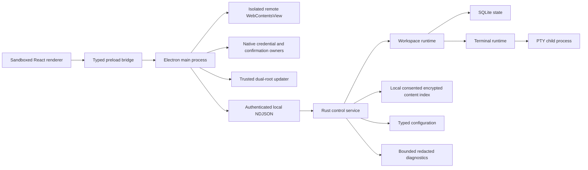

# Architecture overview

This document describes the implemented architecture through Milestone 8. Milestones 6 and 7 have
focused independent acceptance evidence; Milestone 8 is implementation-complete and awaits its
independent acceptance re-review and exact-candidate qualification. The
[implementation specification](IMPLEMENTATION_SPEC.md) also describes release gates and optional
work that are not necessarily qualified or present.

## Trust and ownership boundaries

- **Electron main** owns the window, persisted-bounds coordination, bounded service supervision and
  renderer recovery, safe-storage integration, the path-confined packaged renderer protocol,
  validated IPC handlers, system-notification policy, isolated browser views and sessions,
  external URL opening, native remote credential/host-key and destructive-confirmation boundaries,
  bounded sidebar export, package-type detection, and the update state machine.
- **Preload** exposes a frozen, operation-specific `desktopBridge`; it does not expose
  `ipcRenderer`, Node.js, or a generic command channel.
- **React renderer** owns the visual xterm.js projection, dialogs, drag state, and other ephemeral
  controls. Zustand stores the latest authoritative projection but does not invent domain state.
- **Rust control service** owns authenticated clients, revisions, replay, workspace/notification,
  agent, remote, and sidebar projections, derived attention, typed configuration, durable window
  and sidebar state, path authorization, authoritative task state, bounded structured logs, and
  command dispatch through the workspace runtime.
- **Workspace runtime** owns the exact tab-to-terminal lifecycle mapping and persists commandless
  workspace state through the storage boundary.
- **Terminal runtime** owns PTY creation, input/output, cell resize, child exit, ordered output,
  and reload checkpoint coordination.

Renderer reloads therefore replace only the projection layer. They do not restart the service or
the PTY.

## Current repository components

| Component                      | Current responsibility                                                                               |
| ------------------------------ | ---------------------------------------------------------------------------------------------------- |
| `apps/desktop/src/main`        | Window/state, supervision, control/IPC, browser/update, credentials, confirmation, export            |
| `apps/desktop/src/preload`     | Narrow typed bridge for domain, recovery, terminal, agent, remote, and sidebar operations            |
| `apps/desktop/src/renderer`    | Workspace UI, browser, notifications, xterm.js, agent/remote settings, and eight sidebar surfaces    |
| `packages/protocol-client`     | Generated DTOs plus Zod validation for untrusted wire data                                           |
| `crates/protocol`              | Versioned Rust wire types, capabilities, and message-size constants                                  |
| `crates/core`                  | Checked workspace, pane, tab, notification, attention, shortcut/revision invariants                  |
| `crates/storage`               | Schema-v15 SQLite state for workspaces, agent/remote identity, sidebar/content, and fenced mutations |
| `crates/config`                | Versioned typed configuration with bounded validation and atomic replacement                         |
| `crates/diagnostics`           | Owner-only rotating logs, recursive redaction, preview, and bounded export                           |
| `crates/workspace-runtime`     | Domain mutations, persistence ordering, and terminal lifecycle ownership                             |
| `crates/control-server`        | Authenticated transport, browser/agent/remote/sidebar dispatch, replay, events, and backpressure     |
| `crates/terminal-runtime`      | Cross-platform PTY lifecycle plus SSH/tmux launch, reconnect, and credential handoff                 |
| `crates/agent-session-runtime` | Adapter-owned restore/fork/hibernate planning without process-memory cloning                         |
| `crates/content-index`         | Local consented encrypted indexing, retention/exclusion/forget/rebuild, and bounded search/export    |
| `crates/notification-runtime`  | Secure ephemeral CLI discovery records                                                               |
| `crates/cli`                   | Public workspace/terminal/pane/notify commands and reversible hook adapters                          |
| `crates/service`               | Service executable and lifecycle wiring                                                              |

## Terminal data flow

1. Electron main starts the service, transfers the control token through the child's stdin, and
   connects to the per-user local endpoint.
2. After a machine-readable ready record, Electron verifies identity and the complete Milestone 5
   capability set. The renderer requests authoritative workspace/settings projections.
3. Workspace, pane, tab, terminal-restart, and shortcut mutations cross the same strictly validated
   preload and control boundaries. Successful mutations return a revision-matched full snapshot.
4. Named invalidation events trigger projection refresh; revision gaps force an explicit resync.
5. A terminal tab attaches by its backend-owned runtime session ID. Main validates the sender and
   arguments before using the local protocol.
6. `portable-pty` creates the child PTY. Blocking PTY reads run outside Tokio's async worker pool.
7. Raw PTY output is split into at most 64 KiB chunks, assigned monotonically increasing sequence
   numbers, base64-encoded, and emitted only to clients attached to that terminal.
8. The renderer applies ordered output to xterm.js and periodically serializes its projection.
9. On reload, `terminal.attach` returns the latest checkpoint and subsequent journal chunks. The
   renderer restores them before accepting the live stream.

The service remains authoritative for process life and byte ordering. xterm.js remains authoritative
for terminal emulation and the visible projection; the service deliberately does not implement a
second terminal emulator.

## Workspace sidebar metadata flow

1. The renderer requests runtime metadata for the selected workspace by its validated identifier and
   refreshes it at a bounded interval.
2. Main fetches a fresh authoritative workspace snapshot and uses its working directory; the renderer
   cannot supply an arbitrary filesystem path.
3. Main resolves the branch and a clean/dirty summary with one shell-free, one-second
   `git status --porcelain=v2 --branch` query, a bounded output buffer, disabled prompts and
   global/system Git configuration, and strict shape, count, control-character, and length
   validation. The summary distinguishes staged, unstaged, untracked, and conflicted state plus
   upstream ahead/behind counts. Detached heads omit only the branch; non-repositories, missing Git,
   malformed output, and failures yield unavailable Git metadata instead of exposing diagnostics or
   path details.
4. A terminal attachment seeds the process label from the executable basename. Subsequent sanitized
   xterm title events update that label. These labels are ephemeral renderer state keyed by tab and do
   not replace the service-owned terminal lifecycle or workspace projection.
5. The selected-workspace poll asks the authenticated service for `terminal.runtimeMetadata` only
   when the authoritative selected tab is a live terminal. The service owns the terminal PID, takes
   native cross-platform snapshots of its descendant process tree and TCP listening sockets on a
   blocking worker, and returns only a sorted, deduplicated, 16-port summary. PIDs and process paths
   never cross the service boundary; failed advisory discovery returns an empty list.

## Browser data flow

1. The service creates an authoritative browser tab state with an app-owned persistent partition.
2. The renderer requests a mount through its typed bridge; main verifies the exact workspace, tab,
   and browser-session association against a fresh service snapshot before creating a view.
3. Main creates the remote view without a preload or Node privileges, owns its session policies,
   and applies coalesced bounds only while its renderer pane is visible.
4. Renderer toolbar actions first mutate revision-checked service state. Main then applies the
   corresponding native navigation action and observes the resulting URL, title, loading, history,
   and devtools state back into the service with monotonic revisions.
5. Unmount detaches and preserves a view for tab reuse; an authoritative tab close, window close,
   crash, or manager disposal destroys it exactly once.

## Agent and remote-session flow

1. Agent records bind one durable session identity to an exact workspace, pane, and tab. Restore
   evidence is classified as live reattach, tool-supported resume, layout-only restart, or
   unavailable; the system never claims process-memory cloning.
2. Forks receive fresh identities and immutable provenance. Durable team/member and attention
   records preserve exact routing through restart. Hibernation distinguishes checkpointed work from
   warned destructive disposition, and destructive operations require main-owned confirmation.
3. Remote targets and sessions are service-owned. Electron main owns host-key prompts and native
   credential lookup/rotation; secrets are handed to the SSH child by file descriptor and do not
   enter SQLite, renderer state, protocol projections, logs, or generic diagnostics.
4. Transport loss advances the exact session generation through reconnecting, detached, or failed
   state. Remote tmux discovery/create/attach is bounded and preserves target/session/tmux identity
   across restart and reconnect. Remote browser routing and notification relay are not part of this
   implemented boundary.

## Right-sidebar and content flow

1. The service owns a durable registry of exactly eight surfaces: TextBox, Vault, Task Manager,
   Files, Markdown, Diff, Search, and Recently Closed. Placement, enabled/order/selection, and width
   are strictly bounded; the renderer owns only presentation and transient focus.
2. Filesystem roots come from authoritative workspaces. Main and the service exchange opaque,
   revisioned document identities; reads are bounded and re-authorized, Markdown is emitted as a
   safe AST, and diffs never grant a raw path or generic filesystem bridge to the renderer.
3. Vault/Search indexing is local and disabled until consent. The encrypted index applies retention
   and per-source exclusions and supports forget/rebuild. Export is bounded to one source and
   requires native confirmation; generic diagnostics exclude indexed content.
4. Task Manager exposes only authoritative agent and remote tasks. Destructive actions cross a
   typed IPC operation and main-owned confirmation before returning to the service. Recently Closed
   reuses the durable fresh-ID reopen contract.

## Persistence and recovery flow

1. SQLite schema v15 stores the checked workspace snapshot, durable window/sidebar state, bounded
   replay records, agent/team/attention state, remote target/session state, TextBox documents,
   recently closed records, and task confirmation outcomes. Supported older schemas first create an
   owner-only, WAL-consistent backup and then run each ordered migration transactionally; failure
   rolls back the source and retains the backup.
2. The separate schema-v2 configuration file contains every typed settings section and explicitly
   migrates supported schema-v1 values. Updates use a revision check, complete-section validation,
   and atomic same-directory replacement. The shared
   renderer/runtime projection hydrates and live-applies appearance theme/density, terminal font
   family/size/scrollback/multiline-paste protection, and notifications. The terminal runtime owns
   the configured shell: startup hydrates it before workspace restoration, and a validated live
   update affects only future implicit terminal launches. The service owns a reloadable structured
   logging filter; persisted level changes take effect after the configuration transaction and all
   other fallible runtime updates complete. Browser profile/privacy fields persist in the schema,
   but unsupported controls remain disabled and labeled deferred. Agent-session and remote-session
   settings use their typed runtime owners. The update channel is persisted and live: main maps it
   only to one of its two prevalidated feed roots.
3. An unexpected service exit unbinds the stale client and makes bounded restart attempts. A
   successful restart reloads durable workspace metadata into a new service and creates new PTYs;
   the UI explicitly says that live terminal processes were lost.
4. An unexpected renderer exit reloads the renderer once while Electron and the service remain
   alive, so terminal attachment reconstruction retains the same service and PTYs.
5. A typed `service.recoveryRequired` startup record enters recovery UI instead of silently
   resetting state. Read-only inspection, recovery export, and diagnostic preview/export run as
   isolated service utility invocations. The UI receives only migration-backup availability as a
   safe boolean; after failure with a secured backup, the path remains private to the main process.
6. Healthy recovery export uses SQLite's online-backup API and includes committed WAL state. If
   SQLite is corrupt or unusable, export copies the exact main database file as evidence and does
   not merge `-wal` or `-shm` sidecars.

## CLI and update flow

1. The packaged CLI reads an ephemeral owner-only discovery record and authenticates over the same
   bounded NDJSON protocol as desktop main. Public subcommands map to explicit service mutations;
   there is no generic command passthrough or token flag.
2. Main accepts update roots only from its runtime environment, and only when both stable and beta
   roots are distinct safe HTTPS base URLs. The renderer can save a channel, never a URL.
3. A periodic or manual check reports availability without downloading. Download and
   install/restart are separate explicit actions; sanitized state crosses the preload boundary.
4. Feed-free AppImage/deb/rpm, macOS DMG/zip, and Windows NSIS output is the default. Update metadata
   generation is an explicit channel build and does not upload. Deterministic Linux SHA-256 release
   manifests are separate from the electron-updater metadata's SHA-512 artifact hashes.

## Milestone boundary

M6 agent restoration/orchestration, M7 SSH/remote tmux, and M8 right-sidebar productivity surfaces
are implemented and independently accepted against their focused criteria. M8 packaged runtime
execution remains pending. No milestone
status in this document establishes exact-candidate qualification. Final `pnpm validate`, global
Rust/Electron suites, visual/accessibility/performance/package evidence, human assistive-technology
and native-platform checks, signing/notarization, hosted feeds, and publication remain separate
release gates. See the [roadmap](../ROADMAP.md), [M6 evidence](validation/m6-agent-sessions.md),
[M7 evidence](validation/m7-remote-sessions.md), [M8 evidence](validation/m8-sidebar-surfaces.md),
and [known limitations](KNOWN_LIMITATIONS.md).

The latest local packaged smoke on 2026-07-21 averaged 0.8893% process-tree CPU during its
five-minute idle window after a five-minute quiet settle. This is host-specific smoke evidence;
the exact eight-hour soak and a maintained cross-host baseline remain unproven.

## Durable decisions

Architecture decisions are recorded in [the ADR index](decisions/README.md). Changes to process,
protocol, persistence, or security boundaries should begin with the repository's RFC issue
template and, once accepted, an ADR.
