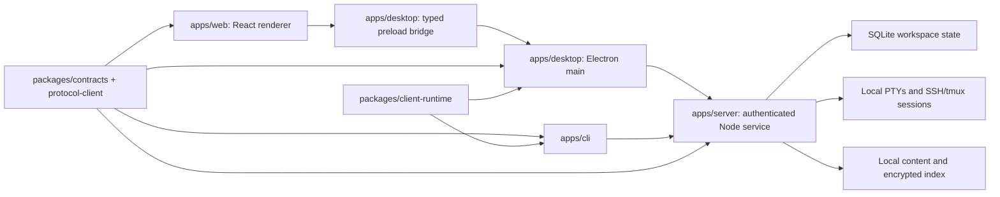

# Architecture

Agent Workspace is a Linux desktop application built with Electron, React, and TypeScript. The privileged backend is a separate Node.js process using Hono and plain TypeScript services. The Linux package includes its own pinned Node runtime, server, CLI, and native addons. No Rust runtime or build toolchain is part of the current application.

## Ownership and trust

- `apps/server` owns workspace revisions and mutations, persisted state, terminal processes, agent and remote sessions, notifications, and content. The server accepts only validated, authenticated local requests. It uses Hono at the transport boundary; domain logic lives in TypeScript services.
- `apps/desktop` owns native windows, isolated remote browser views, OS prompts, credential handoff, updates, and Node process supervision. Its preload exposes specific operations to the renderer rather than Node or generic IPC access.
- `apps/web` owns presentation, terminal rendering with xterm.js, and temporary UI state. It refreshes from authoritative server projections after changes and reconnects.
- `apps/cli` uses the same private Node service session and contracts as the desktop. CLI commands are named operations, not an arbitrary server-command passthrough.
- `packages/contracts` defines desktop and domain contracts. `packages/protocol-client` retains validated wire DTOs and compatibility fixtures. `packages/client-runtime` implements the typed authenticated client transport.

The server creates or opens an owner-only SQLite database at `state/workspace.sqlite` under the Electron user-data directory. Fresh profiles are initialized by the Node service. Existing schema-v15 profiles are opened under an exclusive owner lock with a private pre-migration backup. This protects stored state; real user-profile migration still requires release qualification. See [ADR 0014](decisions/0014-node-service-migration.md) and the [cutover preflight](node-cutover-preflight.md).

## Runtime flow

1. Electron main resolves the bundled Node executable and starts `apps/server` with a private state path and a token supplied through the private child environment.
2. The server emits a bounded ready record. Main connects through the authenticated local endpoint and binds each window to its authoritative workspace projection.
3. Renderer operations cross the typed preload bridge. Main checks the sending window and forwards validated requests to the Node service. A successful state mutation returns a revisioned projection, and named events trigger refresh.
4. The Node terminal runtime owns PTY lifetimes and ordered output. The renderer owns the xterm.js display projection and checkpoints. A renderer reload attaches to the existing server process; a server restart recreates terminals from durable workspace metadata.
5. Remote SSH/tmux and agent sessions are durable service records. Main owns native host-key and credential prompts and keeps secrets out of renderer state, SQLite projections, and generic diagnostics.
6. Local content, Vault/search, sidebar tasks, and browser automation use explicit capability and owner checks. Remote web content runs in isolated Electron views without preload or Node privileges.

## Packaging and qualification

The Linux build stages the exact Node executable, server, CLI, and native addons under `resources/node-linux`. [Linux packaging](node-linux-packaging.md) documents the candidate build and inspector. [Releasing](RELEASING.md) lists the remaining release evidence. A successful source build or isolated-profile run is not proof of a qualified release.

The original Rust-first [implementation specification](IMPLEMENTATION_SPEC.md), [parity breakdown](PARITY_WORK_BREAKDOWN.md), and [milestone evidence](validation/) remain as historical design and test records. Their process diagrams, crate paths, and commands do not describe the current runtime. ADR 0014 records the migration decision.
