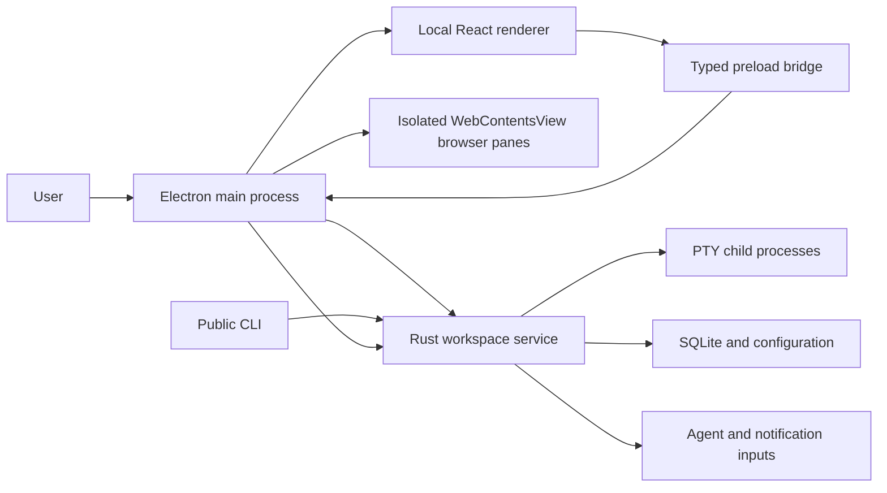

# Independent Cross-Platform Agent Workspace

<!-- markdownlint-disable MD013 MD060 -->

## Full Implementation Specification

**Status:** Living specification; Milestone 5 established on the documented Linux reference host  
**Audience:** Maintainers, contributors, reviewers, release engineers, and security reviewers  
**Primary target:** Linux desktop  
**Secondary targets:** macOS and Windows  
**Document version:** 0.1

---

## 1. Purpose

This document specifies an independent open-source desktop application for running and organizing terminal-based coding agents. The application combines terminal workspaces, tabs, split panes, agent attention notifications, an embedded browser, session restoration, and a programmable command-line interface.

The project has its own identity, architecture, protocol, configuration, package namespace, release process, and governance. Public package names, environment variables, file paths, types, commands, and documentation must use the project's eventual brand. Until that brand is selected, this specification uses the placeholders `PROJECT_NAME`, `PROJECT_SLUG`, `PROJECT_SCOPE`, and `PROJECT_ENV`. The current repository centralizes the temporary slug `agent-workspace`; it is an implementation placeholder and not a selected public product name.

This is an implementation specification, not a product brainstorm. Requirements marked **MUST** are release-blocking. Requirements marked **SHOULD** are expected unless an accepted architecture decision record documents why they are deferred. Requirements marked **MAY** are optional.

---

## 2. Product Definition

### 2.1 Vision

The application is a fast, keyboard-first workspace for developers who run multiple coding agents and development processes concurrently. It should make three actions effortless:

1. See which workspace needs attention.
2. Understand why it needs attention.
3. Jump directly to the relevant pane and continue working.

### 2.2 Product principles

- **Terminal first:** The application augments terminal workflows instead of replacing them with an agent-specific workflow.
- **Backend authoritative:** Workspace, pane, tab, process, notification, and persistence state belong to the Rust service.
- **Composable primitives:** Workspaces, panes, tabs, terminals, browsers, notifications, and commands can be combined without prescribing one workflow.
- **Keyboard complete:** Every primary operation is available without a pointer.
- **Programmable:** Every stable UI action has a corresponding protocol command when practical.
- **Cross-platform by design:** Platform differences are isolated behind explicit interfaces.
- **Local first:** Core operation requires no account, cloud service, or telemetry.
- **Secure by default:** Remote browser content and terminal processes never receive Electron privileges.
- **Community legible:** The repository, architecture, issues, RFCs, and release process are understandable to outside contributors.

### 2.3 Primary users

- Developers running multiple instances of terminal coding agents.
- Developers managing several repositories, branches, servers, and test processes.
- Users who want terminal and browser panes in one programmable workspace.
- Open-source contributors who want to extend agent integrations, commands, or platform support.

---

## 3. Scope

### 3.1 Version 1.0 scope

Version 1.0 MUST include:

- Linux desktop application for X11 and Wayland.
- Workspaces with names, descriptions, colors, and working directories.
- Recursive horizontal and vertical split panes.
- Multiple tabs within each pane.
- Local terminal tabs backed by real PTYs.
- Embedded browser tabs backed by isolated Electron `WebContentsView` instances.
- Workspace sidebar with current directory, git branch, process title, and attention state.
- Command palette.
- Context menus and editable keyboard shortcuts.
- In-app notification center.
- Agent attention events from terminal escape sequences and the public CLI.
- Session layout restoration.
- Local control protocol and public CLI.
- Search within terminal scrollback.
- Copy, paste, selection, links, Unicode, IME, and common terminal mouse protocols.
- Settings UI and versioned configuration file.
- AppImage, Debian, and RPM release artifacts.
- Automated update support for supported release artifacts.
- Dark and light themes with project-owned design tokens.
- Accessibility baseline for keyboard navigation, screen readers, contrast, and reduced motion.

### 3.2 Post-1.0 scope

The following are planned after a stable Linux release:

- macOS packaging, signing, notarization, and platform shortcut mapping.
- Windows packaging, ConPTY verification, and named-pipe verification.
- Browser automation API.
- SSH workspace orchestration and remote port routing.
- Plugin SDK and registry.
- Remote attach clients.
- Optional persistent background service.
- Session handoff between devices.
- Cloud workspaces or managed virtual machines.
- Collaborative sessions.

### 3.3 Explicit non-goals for 1.0

- Implementing a code editor.
- Replacing shells, terminal applications, or coding agents.
- Checkpointing arbitrary process memory.
- Supporting arbitrary third-party plugins in the main process.
- Loading remote web application code into the privileged UI renderer.
- Shipping a cloud account requirement.
- Pixel-identical use of native operating-system controls. Visual consistency is preferred over platform-native appearance.

---

## 4. Naming and Identity

### 4.1 Required placeholders

Before the first public release, maintainers MUST replace:

| Placeholder     | Example form           | Purpose                         |
| --------------- | ---------------------- | ------------------------------- |
| `PROJECT_NAME`  | Human-readable brand   | Window titles and documentation |
| `PROJECT_SLUG`  | lowercase ASCII slug   | Binary, directories, desktop ID |
| `PROJECT_SCOPE` | npm organization scope | Published TypeScript packages   |
| `PROJECT_ENV`   | uppercase identifier   | Environment-variable prefix     |

### 4.2 Naming rules

- Public JavaScript packages MUST use `@PROJECT_SCOPE/*`.
- Public Rust crates and binaries MUST use the selected project brand.
- Configuration MUST live under the selected project slug.
- Environment variables MUST start with `PROJECT_ENV_`.
- Desktop application IDs MUST use a project-owned reverse-DNS identifier.
- No public name may imply affiliation with another project or company.
- Internal concepts use the neutral terms workspace, pane, tab, terminal, browser, notification, agent, and command.

### 4.3 Open-source identity files

The initial public repository MUST contain:

- `README.md`
- `LICENSE`
- `NOTICE`
- `CONTRIBUTING.md`
- `GOVERNANCE.md`
- `CODE_OF_CONDUCT.md`
- `SECURITY.md`
- `ROADMAP.md`
- `CHANGELOG.md`
- `.github/CODEOWNERS`
- Bug, feature, and RFC issue templates
- Pull-request template

### 4.4 Licensing assumption

This specification assumes GPL-3.0-or-later for the complete application. This is the conservative choice when behavior or code may derive from GPL software. If maintainers want a permissive license, they MUST complete a provenance and legal review before accepting external contributions. Branding independence does not remove source-license obligations.

Every copied or adapted source file MUST retain required notices. `NOTICE` MUST record the upstream project, source URL, commit or version, files involved, license, and nature of the modification.

---

## 5. System Architecture

### 5.1 Process model



The application consists of four trust domains:

1. **Electron main process:** Owns windows, menus, application lifecycle, browser views, OS integration, updates, and the Rust service process.
2. **Local renderer:** Runs packaged React code only. It owns presentation state and no Node.js privileges.
3. **Remote browser views:** Load untrusted remote content with no preload script, no Node.js integration, context isolation, sandboxing, and restricted permissions.
4. **Rust service:** Owns domain state, PTYs, persistence, local protocol, notifications, configuration, and CLI commands.

### 5.2 Architectural boundaries

- The Rust service is the source of truth for all persistent and process-related state.
- The renderer MAY hold ephemeral presentation state such as open menus, hover state, local drag state, and unfinished form input.
- The renderer MUST NOT create independent authoritative copies of workspace or pane state.
- Electron main MUST NOT contain product domain rules beyond native window and browser-view orchestration.
- Remote browser views MUST NOT access the preload bridge.
- Public CLI commands and UI actions MUST call the same Rust mutation functions.
- Platform-specific code MUST live behind the `platform` crate or Electron main-process adapters.

### 5.3 Technology stack

#### Desktop and UI

- Electron
- electron-vite and Vite
- React and TypeScript
- Tailwind CSS
- shadcn source components using Radix primitives
- Zustand for projection and presentation state
- Zod for renderer/preload boundary validation
- xterm.js for terminal rendering and serialized terminal checkpoints
- react-resizable-panels for nested split layout
- dnd-kit for tab and workspace drag interactions
- electron-builder and electron-updater

#### Rust service

- Tokio
- portable-pty
- interprocess
- Serde and serde_json
- ts-rs
- UUID
- Clap
- rusqlite with bundled SQLite
- tracing and tracing-subscriber
- directories
- notify
- keyring and zeroize

### 5.4 Dependency policy

- Production dependencies require active maintenance, an OSI-approved license, and a recorded purpose.
- Dependency additions require a short justification in the pull request.
- Duplicate libraries serving the same purpose SHOULD be rejected.
- Lockfiles MUST be committed.
- Automated dependency updates MUST run tests before merge.
- Native dependencies MUST be tested in packaged artifacts, not only development mode.
- Experimental packages MUST be isolated behind project-owned interfaces.

### 5.5 Initial dependency inventory

Renderer and desktop runtime dependencies:

```text
react
react-dom
zustand
immer
zod
radix-ui
class-variance-authority
clsx
tailwind-merge
lucide-react
react-resizable-panels
@dnd-kit/core
@dnd-kit/sortable
@dnd-kit/modifiers
@xterm/xterm
@xterm/addon-fit
@xterm/addon-webgl
@xterm/addon-search
@xterm/addon-web-links
@xterm/addon-clipboard
@xterm/addon-serialize
@xterm/addon-unicode11
cmdk
sonner
react-hook-form
@hookform/resolvers
@tanstack/react-virtual
electron-updater
```

Desktop development, packaging, and test dependencies:

```text
electron
electron-vite
vite
@vitejs/plugin-react
typescript
tailwindcss
@tailwindcss/vite
electron-builder
@electron/fuses
vitest
jsdom
@testing-library/react
@testing-library/user-event
@playwright/test
eslint
typescript-eslint
prettier
```

Rust service dependencies:

```text
tokio
portable-pty
interprocess
serde
serde_json
ts-rs
uuid
base64
uzers
which
clap
thiserror
anyhow
tracing
tracing-subscriber
tracing-appender
directories
notify
rusqlite
keyring
zeroize
bytes
futures-util
tokio-util
```

The project MUST NOT use `node-pty` while the Rust service owns PTYs. It MUST NOT add a second general-purpose component library, state store, or persistence layer without an accepted ADR.

---

## 6. Repository Layout

```text
PROJECT_SLUG/
├── apps/
│   ├── desktop/
│   │   ├── src/main/
│   │   ├── src/preload/
│   │   ├── src/renderer/
│   │   ├── resources/
│   │   └── package.json
│   ├── website/
│   └── docs-site/
├── packages/
│   ├── ui/
│   ├── design-tokens/
│   ├── protocol-client/
│   ├── desktop-bridge/
│   ├── config/
│   ├── eslint-config/
│   └── tsconfig/
├── crates/
│   ├── core/
│   ├── protocol/
│   ├── control-server/
│   ├── terminal-runtime/
│   ├── session-store/
│   ├── notification-runtime/
│   ├── platform/
│   ├── service/
│   └── cli/
├── integrations/
│   ├── agents/
│   ├── shells/
│   └── editors/
├── adapters/
│   └── upstream-v7/
├── plugins/
│   ├── sdk/
│   ├── examples/
│   └── registry/
├── tests/
│   ├── protocol/
│   ├── e2e/
│   ├── visual/
│   ├── performance/
│   └── fixtures/
├── packaging/
│   ├── linux/
│   ├── macos/
│   └── windows/
├── docs/
│   ├── architecture/
│   ├── decisions/
│   ├── rfcs/
│   ├── protocol/
│   └── contributing/
├── scripts/
├── .github/
├── Cargo.toml
├── package.json
├── pnpm-workspace.yaml
└── rust-toolchain.toml
```

Top-level directories MUST remain limited to stable ownership boundaries. Features belong inside the owning application, package, or crate rather than creating one top-level directory per feature.

---

## 7. Domain Model

### 7.1 Entity hierarchy

```text
Application state
└── Window
    └── Workspace
        └── Pane tree
            └── Leaf pane
                └── Tabs
                    ├── Terminal tab
                    ├── Browser tab
                    └── Future plugin tab
```

### 7.2 IDs

- All persistent entities MUST have opaque UUID identifiers generated by the Rust service.
- IDs MUST NOT encode array positions, process IDs, filesystem paths, or platform handles.
- The protocol MAY expose short human-readable aliases, but aliases never replace persistent IDs.
- Electron `WebContents` IDs and operating-system PIDs MUST remain internal implementation details.

### 7.3 Workspace

```rust
struct Workspace {
    id: WorkspaceId,
    name: String,
    description: Option<String>,
    color: Option<ColorToken>,
    working_directory: PathBuf,
    root: PaneNode,
    selected_pane_id: PaneId,
    attention: AttentionSummary,
    created_at: Timestamp,
    updated_at: Timestamp,
}
```

Requirements:

- Names MUST be non-empty after trimming and limited to 128 Unicode scalar values.
- Working directories MUST be absolute after backend resolution.
- A workspace MUST always contain at least one pane.
- Closing the final workspace MUST create a new empty workspace unless the window is closing.
- Workspace order MUST be persisted separately from entity creation time.

### 7.4 Pane tree

```rust
enum PaneNode {
    Leaf { pane_id: PaneId },
    Split {
        id: SplitId,
        axis: SplitAxis,
        ratio: f32,
        first: Box<PaneNode>,
        second: Box<PaneNode>,
    },
}

enum SplitAxis {
    Horizontal,
    Vertical,
}
```

Invariants:

- `ratio` MUST be finite and clamped to `0.05..=0.95`.
- Every referenced pane MUST exist exactly once in the tree.
- Removing a leaf MUST collapse its parent into the surviving sibling.
- A split mutation MUST be atomic.
- Tree mutations MUST increment the workspace revision.

### 7.5 Pane

```rust
struct Pane {
    id: PaneId,
    tabs: Vec<TabId>,
    selected_tab_id: TabId,
    title: Option<String>,
    attention: AttentionSummary,
}
```

- A pane MUST always contain at least one tab while it exists.
- Closing the final tab closes the pane unless it is the final pane, in which case a replacement terminal tab is created.
- Tab order and selection MUST be backend authoritative.

### 7.6 Tab

```rust
struct Tab {
    id: TabId,
    pane_id: PaneId,
    title: String,
    custom_title: Option<String>,
    content: TabContent,
    attention: AttentionState,
    created_at: Timestamp,
}

enum TabContent {
    Terminal(TerminalSessionId),
    Browser(BrowserSessionId),
}
```

### 7.7 Terminal session

The backend stores:

- PTY identifier and child process metadata.
- Shell or command invocation.
- Working directory.
- Current rows and columns.
- Environment overrides approved for persistence.
- Process title and last-known foreground process.
- Exit status.
- Resume metadata when a supported agent provides it.

Secrets, access tokens, passwords, and environment variables matching configurable sensitive-name patterns MUST NOT be persisted.

### 7.8 Browser session

The backend stores stable browser state:

- Browser session ID.
- Current URL.
- Navigation title.
- Back/forward availability.
- Loading state.
- DevTools state.
- Profile partition identifier.

Electron main owns the live `WebContentsView` and maps it to the backend browser session ID.

### 7.9 Notification and attention

```rust
struct Notification {
    id: NotificationId,
    workspace_id: WorkspaceId,
    pane_id: Option<PaneId>,
    tab_id: Option<TabId>,
    source: NotificationSource,
    level: NotificationLevel,
    title: String,
    body: Option<String>,
    created_at: Timestamp,
    read_at: Option<Timestamp>,
}
```

Attention is derived from unread notifications and agent state. It MUST NOT be an independently editable boolean that can drift from notification records.

---

## 8. State Ownership and Synchronization

### 8.1 Authoritative state

The Rust service owns:

- Workspace order and metadata.
- Pane trees and ratios.
- Pane and tab order.
- Selected workspace, pane, and tab.
- PTY lifecycle.
- Browser session metadata.
- Notifications and read state.
- Settings and session snapshots.

### 8.2 Renderer state

The renderer owns only:

- Open popovers, dialogs, and menus.
- Hover, drag preview, and pointer state.
- Unsaved settings-form values.
- Measured pixel bounds.
- xterm.js renderer instances and viewport state.
- Temporary connection and error presentation.

### 8.3 Projection store

The React application uses one vanilla Zustand store with slice selectors. Store slices SHOULD include:

- `connection`
- `workspaceProjection`
- `terminalAttachments`
- `browserBounds`
- `notificationsProjection`
- `commandsProjection`
- `settingsDraft`
- `transientUi`

Components rendering lists MUST select immutable row snapshots rather than subscribing every row to the entire store.

### 8.4 Mutation flow

1. UI sends a request with a unique request ID.
2. The renderer MAY apply a clearly tracked optimistic projection.
3. Backend validates and commits the mutation atomically.
4. Backend returns the new revision and emits an invalidation event.
5. Renderer reconciles against the authoritative snapshot.
6. On failure, renderer rolls back the optimistic projection and presents an actionable error.

Mutations MUST be idempotent where practical. Destructive mutations MUST support duplicate-request detection for a bounded period.

---

## 9. Local Protocol

### 9.1 Transport

- Linux and macOS use a Unix-domain local socket.
- Windows uses a named pipe through the same project-owned transport interface.
- The implementation uses `interprocess` for the cross-platform local-socket abstraction.
- Messages use UTF-8 newline-delimited JSON.
- Each request and response occupies one line.
- Embedded newline characters are JSON-escaped.
- The maximum control message is 1 MiB.
- Terminal output chunks MUST be no larger than 64 KiB before base64 encoding.
- Serialized terminal checkpoint JSON MUST be no larger than 512 KiB on the wire.
- Oversized, malformed, or unauthenticated messages MUST close the connection after an error response when safe.

### 9.2 Socket location

Linux lookup order:

1. `PROJECT_ENV_SOCKET` explicit override.
2. `$XDG_RUNTIME_DIR/PROJECT_SLUG/control.sock`.
3. A per-user directory under the system temporary directory.

The runtime directory MUST be owned by the current user and mode `0700`; the socket MUST be mode `0600`. Windows named-pipe ACLs MUST restrict access to the current user.

### 9.3 Authentication

- The desktop process generates a 256-bit local control token on first run.
- The token is stored in the OS credential store.
- CLI and desktop clients send the token in a transport preamble before commands.
- The service rate-limits failed authentication attempts.
- Authentication tokens MUST never appear in logs, process arguments, URLs, crash reports, or session snapshots.

### 9.4 Version negotiation

Client begins with:

```json
{"auth":{"token":"redacted"}}
{"id":"req-1","command":"system.identify","params":{}}
```

Service responds:

```json
{
  "id": "req-1",
  "ok": true,
  "result": {
    "application": "PROJECT_SLUG",
    "version": "0.1.0",
    "protocolVersion": 1,
    "capabilities": ["terminal", "notifications", "browser"]
  }
}
```

Clients MUST reject an unexpected application ID and MUST negotiate capabilities before using optional commands.

### 9.5 Envelopes

Request:

```json
{ "id": "req-2", "command": "workspace.list", "params": {} }
```

Success:

```json
{ "id": "req-2", "ok": true, "revision": 42, "result": {} }
```

Failure:

```json
{
  "id": "req-2",
  "ok": false,
  "error": {
    "code": "workspace_not_found",
    "message": "The workspace no longer exists",
    "details": {}
  }
}
```

Event:

```json
{ "event": "workspace.changed", "revision": 43, "data": { "workspaceId": "..." } }
```

### 9.6 Required commands

| Group        | Commands                                                                                                                                                            |
| ------------ | ------------------------------------------------------------------------------------------------------------------------------------------------------------------- |
| System       | `system.identify`, `system.ping`, `system.capabilities`, `system.subscribe`                                                                                         |
| Workspace    | `workspace.list`, `workspace.create`, `workspace.update`, `workspace.select`, `workspace.move`, `workspace.close`                                                   |
| Pane         | `pane.split`, `pane.focus`, `pane.resize`, `pane.close`, `pane.moveTab`                                                                                             |
| Tab          | `tab.openTerminal`, `tab.openBrowser`, `tab.select`, `tab.update`, `tab.move`, `tab.close`                                                                          |
| Terminal     | `terminal.attach`, `terminal.detach`, `terminal.send`, `terminal.sendKey`, `terminal.resize`, `terminal.checkpoint`, `terminal.runtimeMetadata`, `terminal.restart` |
| Browser      | `browser.navigate`, `browser.back`, `browser.forward`, `browser.reload`, `browser.stop`, `browser.openDevTools`                                                     |
| Notification | `notification.list`, `notification.publish`, `notification.markRead`, `notification.markUnread`, `notification.clear`                                               |
| Settings     | `settings.get`, `settings.update`, `settings.reload`, `settings.resetKey`                                                                                           |
| Session      | `session.save`, `session.restore`, `session.status`                                                                                                                 |

### 9.7 Required events

- `workspace.changed`
- `workspace.selectionChanged`
- `pane.layoutChanged`
- `tab.changed`
- `terminal.output`
- `terminal.resized`
- `terminal.checkpointRequested`
- `terminal.titleChanged`
- `terminal.exited`
- `browser.changed`
- `notification.created`
- `notification.changed`
- `settings.changed`
- `service.shuttingDown`

### 9.8 Backpressure

- Each terminal attachment has an ordered sequence number.
- The service uses bounded per-client queues.
- A slow client receives a `terminal.resyncRequired` event instead of unbounded buffering.
- Renderer responds by requesting the latest checkpoint and restarting the attachment from its sequence number.
- Control responses take priority over bulk terminal output.

### 9.9 Terminal checkpoints and reconnect

The Rust service remains authoritative for the process and byte stream, while xterm.js owns the render projection. To restore that projection after a renderer reload without introducing a second terminal emulator, the primary desktop renderer periodically submits a serialized ANSI checkpoint using `@xterm/addon-serialize`.

- Every PTY output chunk receives a monotonically increasing sequence number.
- The service retains the latest accepted checkpoint and all output chunks after the checkpoint sequence.
- Checkpoints include terminal rows, columns, active buffer state, serialized ANSI data, and the last applied output sequence.
- The renderer submits a checkpoint at least every five seconds while output is active, after one MiB of output since the prior checkpoint, before a graceful detach, and after a completed resize.
- The service accepts checkpoints only from an authenticated client with checkpoint capability and only when the sequence is not ahead of service output.
- `terminal.attach` returns the latest checkpoint followed by output chunks with greater sequence numbers.
- The post-checkpoint journal is bounded. Approaching the bound emits `terminal.checkpointRequested` to the primary desktop client.
- Before the first checkpoint, the service retains a larger bounded startup journal. If no checkpoint-capable client ever attaches and the journal limit is exceeded, later screen reconstruction is explicitly best effort while the PTY remains live.
- Checkpoints are runtime recovery data. Persistent session restoration after full application quit continues to reopen processes rather than claiming to restore live process state.

### 9.10 Generated bindings

Protocol DTOs are defined in the Rust `protocol` crate using Serde and `ts-rs`. CI MUST regenerate TypeScript declarations and fail when generated output differs from committed files.

---

## 10. Rust Service

### 10.1 Service lifecycle

- Electron main starts the service as a child process.
- The service writes a machine-readable ready message only after the socket is accepting connections and storage migrations succeed.
- Electron waits with a bounded startup timeout and shows a recovery UI on failure.
- Unexpected service exit shows a restart option and preserves diagnostic logs.
- Renderer reload MUST NOT restart the service or PTYs.
- Application quit requests an orderly snapshot and shutdown.
- Version 1.0 does not keep the service alive after the desktop application exits.

### 10.2 Core crate

The `core` crate contains domain entities, invariants, mutation services, and event definitions. It MUST NOT depend on Electron, SQLite, terminal rendering, or platform GUI APIs.

### 10.3 Terminal runtime

The `terminal-runtime` crate owns:

- PTY creation through portable-pty.
- Shell and command resolution.
- Input and output streams.
- Window-size updates.
- Child termination and exit status.
- Working-directory observation when available.
- Process-title observation when available.
- Escape-sequence hooks needed for notifications.
- Ordered output journal and checkpoint coordination.

Blocking PTY reads MUST run outside Tokio's async worker threads. PTY failures MUST be converted to stable project error codes.

### 10.4 Shell resolution

Linux order:

1. Explicit workspace command.
2. Configured default shell.
3. User shell from the account database.
4. `$SHELL` when valid and executable.
5. `/bin/sh` fallback.

macOS follows the equivalent account-database path. Windows uses PowerShell 7, Windows PowerShell, then `cmd.exe`, unless configured otherwise.

### 10.5 Child environment

Each terminal receives:

- Standard inherited environment after sensitive-key filtering rules are applied to persistence only.
- `TERM=xterm-256color` by default.
- `COLORTERM=truecolor`.
- `PROJECT_ENV_ACTIVE=1`.
- IDs for the workspace, pane, tab, and socket path using the project prefix.
- Locale variables unchanged unless invalid.

Environment variables MUST be documented as public API before 1.0.

### 10.6 Session restoration

Version 1.0 restores:

- Window geometry.
- Workspace order and metadata.
- Pane split tree and ratios.
- Tabs and selected state.
- Terminal working directories.
- Terminal command/resume metadata when safe.
- Browser URLs.
- Notification read state.

Version 1.0 does not claim to restore arbitrary live process state. Unsupported terminals reopen a configured shell in the restored working directory. Supported agent integrations MAY provide explicit resume commands after user approval.

---

## 11. Desktop Main Process

### 11.1 Responsibilities

- Application lifecycle and single-instance lock.
- Native windows and menus.
- Rust service startup and shutdown.
- Typed IPC between preload and main.
- Browser `WebContentsView` creation, destruction, bounds, focus, and navigation.
- File dialogs and external URL confirmation.
- OS notifications.
- Auto-update orchestration.
- Crash-safe diagnostic collection without terminal contents.

### 11.2 Renderer window

- Renderer loads only packaged local application assets through a custom application protocol.
- `nodeIntegration` MUST be false.
- `contextIsolation` MUST be true.
- `sandbox` MUST be true.
- A restrictive Content Security Policy MUST disallow remote scripts and inline script execution.
- Preload exposes individual validated operations, never raw `ipcRenderer`.
- Every incoming IPC message MUST validate sender and payload.

### 11.3 Browser views

Each browser tab uses a dedicated `WebContentsView` or an explicitly shared session partition according to settings.

Requirements:

- No Node.js integration.
- No application preload script.
- Context isolation and sandboxing enabled.
- Permission requests denied by default and handled through an explicit project-owned prompt.
- New-window creation intercepted.
- Downloads routed through a controlled download manager.
- External protocol navigation requires confirmation.
- Browser view is hidden before bounds become invalid or its tab becomes inactive.
- Destroyed browser tabs release their `WebContents`.

### 11.4 Browser bounds synchronization

The renderer measures browser-pane rectangles using `ResizeObserver` and sends device-independent bounds through the preload bridge. Main process applies bounds at most once per animation frame and rejects stale revisions. Bounds MUST account for device scale factor, window content origin, sidebar visibility, and titlebar mode.

### 11.5 Native menus

Native menus map to the same logical command registry as the command palette and shortcuts. A menu item MUST NOT contain a separate implementation of the action.

---

## 12. Renderer and UI

### 12.1 Component hierarchy

```text
AppShell
├── TitleBar
├── WorkspaceSidebar
├── WorkspaceContent
│   └── SplitLayout
│       └── PaneContainer
│           ├── TabStrip
│           └── ActiveContent
│               ├── TerminalPane
│               └── BrowserPlaceholder
├── NotificationCenter
├── CommandPalette
├── SettingsDialog
└── ToastViewport
```

### 12.2 UI primitives

Project-owned shadcn source components provide buttons, dialogs, menus, tooltips, scroll areas, forms, toggles, and alerts. Product components MUST compose these primitives rather than import a second general-purpose component library.

### 12.3 Design tokens

All foundational styles MUST come from `packages/design-tokens`:

- Colors and semantic surface roles.
- Typography families, weights, sizes, and line heights.
- Spacing scale.
- Border widths and radii.
- Sidebar, tab strip, titlebar, and toolbar dimensions.
- Focus, selection, attention, warning, and destructive states.
- Animation durations and easing.
- Z-index layers.

Product components MUST NOT introduce arbitrary foundational hex colors or unrelated radius systems.

### 12.4 Density

The default desktop density is compact:

- Base UI text: 13px equivalent.
- Metadata text: 11–12px equivalent.
- Tab and toolbar targets: visually compact with an invisible pointer hit target of at least 24px.
- Keyboard focus rings remain visible even when pointer hover treatments are subtle.

Exact values are finalized through reference screenshots and visual tests.

### 12.5 Workspace sidebar

Each row shows, when available:

- Workspace color and name.
- Working-directory basename.
- Git branch.
- Foreground process or agent label.
- Listening-port summary.
- Latest unread notification excerpt.
- Unread count and attention indicator.

Behavior:

- Click selects.
- Double-click begins rename.
- Context menu exposes rename, color, duplicate, move, and close.
- Drag reorders workspaces.
- Keyboard navigation uses roving focus.
- Selected, focused, hovered, and attention states are visually distinct.

### 12.6 Pane layout

- react-resizable-panels renders the recursive split tree.
- Ratios are persisted only after pointer release or a keyboard resize action completes.
- During resize, terminal dimensions update on a trailing debounce no slower than 50 ms.
- Separators support pointer and keyboard resize.
- Double-click resets a separator to the configured default ratio.
- A pane cannot be resized below its minimum terminal cell geometry.

### 12.7 Tabs

- Tabs show title, type icon, attention state, optional process status, and close affordance.
- Selected tabs remain mounted only when required to preserve live terminal renderer state; hidden renderers MUST stop unnecessary animation.
- Pointer drag reorders within a pane.
- Dragging over another pane moves the tab.
- Dropping on directional zones splits the target pane.
- Keyboard commands provide all move and split operations.
- Closing a running terminal uses configurable confirmation behavior.

### 12.8 Terminal pane

Terminal rendering uses xterm.js with fit, WebGL, search, web-links, clipboard, serialize, and Unicode support as compatible versions allow.

Requirements:

- Input is sent as raw bytes or UTF-8 text through the service protocol.
- Resize uses terminal cells, not raw pixels.
- The renderer submits revisioned serialized checkpoints according to the reconnect policy in section 9.9.
- WebGL failure falls back to the canvas renderer.
- Search supports next, previous, case sensitivity, whole word, and regular expression modes.
- Copy-on-select is platform configurable.
- Paste of multiline content can require confirmation.
- Links show the target before opening.
- Terminal focus is restored after closing overlays when appropriate.
- Renderer errors affect one terminal instance and do not crash the application.

### 12.9 Browser pane

React renders the browser toolbar and an empty browser-host rectangle. Electron main positions the native browser view behind or within the corresponding visual region.

Toolbar includes:

- Back and forward.
- Reload or stop.
- Address input.
- Security/status indicator.
- Open externally.
- Developer tools.
- Browser menu.

### 12.10 Notifications

- In-app toasts announce new notifications without stealing terminal focus.
- Workspace, pane, and tab receive derived attention indicators.
- Notification center groups by unread status and time.
- Selecting a notification focuses its target and marks it read only after the target is visible.
- Users can mark read/unread, clear, and jump to latest unread.
- OS notifications are configurable and MUST redact terminal content unless explicitly permitted.

### 12.11 Command palette

The command palette is generated from a central command registry containing:

- Stable command ID.
- Localized title and description.
- Category.
- Availability predicate.
- Default shortcut.
- Parameter schema when applicable.
- Handler invoking the shared action path.

Search supports fuzzy matching, aliases, recent commands, and keyboard-only execution.

### 12.12 Settings

Settings categories:

- Appearance
- Terminal
- Workspaces
- Browser
- Notifications
- Keyboard shortcuts
- Agents and integrations
- Privacy and security
- Updates
- Advanced

Settings changes are validated by the Rust service. Settings with immediate effect update through events; restart-required settings show a clear indicator.

### 12.13 Accessibility

- All interactive elements MUST be keyboard reachable.
- Focus order MUST match visual order.
- Menus, dialogs, tabs, lists, and separators MUST expose correct ARIA semantics.
- Attention MUST not be communicated by color alone.
- Text and controls MUST meet WCAG AA contrast targets.
- Reduced-motion mode MUST disable nonessential movement.
- Screen-reader announcements MUST avoid repeating high-volume terminal output.
- Terminal screen-reader mode remains user controlled.

### 12.14 Localization

- No user-facing string is hard-coded inside behavior code.
- English is the source locale.
- ICU-compatible message keys are preferred.
- Layout supports text expansion and right-to-left migration even if RTL is not a 1.0 requirement.

---

## 13. Keyboard and Focus Model

### 13.1 Logical modifiers

Commands define logical modifiers rather than hard-coded platform keys:

- `Primary`: Command on macOS, Control elsewhere.
- `Secondary`: Option on macOS, Alt elsewhere.
- `Shift`
- `Control`: physical Control when distinct from Primary.

### 13.2 Default actions

| Action             | Logical shortcut  |
| ------------------ | ----------------- |
| Open folder        | `Primary+O`       |
| New terminal tab   | `Primary+T`       |
| Close tab          | `Primary+W`       |
| Split right        | `Primary+D`       |
| Split down         | `Primary+Shift+D` |
| Toggle sidebar     | `Primary+B`       |
| Command palette    | `Primary+Shift+P` |
| Terminal search    | `Primary+F`       |
| Open browser split | `Primary+Shift+L` |
| Notifications      | `Primary+I`       |
| Latest unread      | `Primary+Shift+U` |
| Settings           | `Primary+,`       |

All defaults are editable. Conflicts are detected and shown before save. Users can clear project-owned shortcuts so keypresses reach the terminal.

### 13.3 Focus rules

- One workspace, pane, tab, and content control is active per window.
- Opening a modal stores the prior focus target.
- Closing a modal restores focus if the target still exists.
- Browser and terminal focus transitions are explicit main/renderer operations.
- Workspace switching focuses the selected pane's last-focused control.
- Notification navigation focuses the exact target tab.

---

## 14. Agent and Notification Integration

### 14.1 Sources

Version 1.0 accepts attention events from:

- Supported OSC notification sequences.
- Public CLI `notify` command.
- Agent hook scripts installed with explicit user action.
- Internal process exit or failure events.

### 14.2 Public CLI example

```bash
PROJECT_SLUG notify \
  --title "Agent needs input" \
  --body "Permission required to continue" \
  --workspace "$PROJECT_ENV_WORKSPACE_ID" \
  --tab "$PROJECT_ENV_TAB_ID" \
  --level warning
```

### 14.3 Hook policy

- Hook installation is explicit and reversible.
- Existing configuration is backed up before modification.
- Hooks invoke the public CLI rather than private files or sockets.
- Hook scripts never contain the control token.
- Integration documentation states exactly what files are modified.

---

## 15. Persistence

### 15.1 Paths

Linux:

- Config: `$XDG_CONFIG_HOME/PROJECT_SLUG/config.json` or `~/.config/PROJECT_SLUG/config.json`
- Data: `$XDG_DATA_HOME/PROJECT_SLUG/` or `~/.local/share/PROJECT_SLUG/`
- Cache: `$XDG_CACHE_HOME/PROJECT_SLUG/` or `~/.cache/PROJECT_SLUG/`
- Runtime: `$XDG_RUNTIME_DIR/PROJECT_SLUG/`

macOS and Windows use directories resolved by the Rust `directories` crate and documented per platform.

### 15.2 SQLite

The current implementation uses schema v2. It retains the authoritative application snapshot and
adds checked durable window state with independent revision, bounds, maximized/fullscreen flags,
and an optional display identifier. The broader 1.0 table inventory below remains the target data
model and is not a claim that every item has a dedicated table today.

SQLite stores:

- Schema version.
- Windows.
- Workspaces and ordering.
- Pane nodes and ratios.
- Tabs and selection.
- Terminal restore metadata.
- Browser restore metadata.
- Notifications.
- Approved resume commands.
- Recent commands.

### 15.3 Migrations

- Every schema change includes a forward migration.
- Migrations run in a transaction.
- A pre-migration backup is retained for major migrations.
- Failure does not silently reset user state.
- Downgrade behavior is documented; destructive downgrade is never automatic.
- The implemented v1-to-v2 migration creates an owner-only, WAL-consistent SQLite backup before
  the transaction. Failure rolls back the v1 source and retains the backup for recovery.
- Recovery UI receives migration-backup availability as a safe boolean, including after failure
  with a secured backup, while the backup path remains private to the main process.
- Healthy recovery export uses SQLite online backup and includes committed WAL state. If the
  database is corrupt or otherwise unusable, raw export preserves the exact main-file bytes as
  recovery evidence and deliberately does not merge `-wal` or `-shm` sidecars.

### 15.4 Configuration

`config.json` is human-readable, versioned, and validated. The implemented schema v2 returns a
complete typed snapshot and explicitly migrates supported schema-v1 values; bounded unknown keys
are preserved when safe so compatible newer settings survive read/modify/write. The settings UI
writes complete sections through revision-checked Rust configuration commands using owner-only
atomic same-directory replacement on Unix.

The implemented runtime boundary is narrower than the stored schema. Appearance theme and density,
terminal font family, font size, scrollback, and multiline-paste protection, and notification
policy hydrate and apply live through shared renderer/runtime paths. A configured default shell is
validated on the current host, hydrated before workspace restoration, and applied to future
implicit terminal launches without replacing existing PTYs or explicit workspace commands. The
service owns a reloadable structured-log filter, and persisted level changes apply to subsequent
events only after durable commit and all other fallible runtime updates succeed. Browser
profile/privacy and agent-integration controls are persisted schema fields, but the settings
surface disables and labels them deferred because no runtime owner exists yet. Update controls
select only prevalidated desktop feed roots.

Configuration includes:

- Schema version.
- Appearance and density.
- Terminal shell, font, scrollback, and paste behavior.
- Browser profile and privacy behavior.
- Notification rules.
- Keyboard shortcuts.
- Agent integrations.
- Update channel.
- Logging level.

---

## 16. Security Specification

### 16.1 Threat model

Primary threats:

- Malicious remote websites in browser panes.
- Malicious terminal output and escape sequences.
- Unauthorized local control-socket clients.
- Compromised dependency or update artifact.
- Secret leakage through logs or persistence.
- Path traversal and command injection through CLI parameters.
- Unsafe plugin execution.

### 16.2 Electron requirements

- Current stable Electron release line.
- `nodeIntegration: false` everywhere except trusted main-process code.
- `contextIsolation: true`.
- `sandbox: true`.
- Restrictive CSP for local renderer.
- No raw `ipcRenderer` exposure.
- Sender validation on every IPC handler.
- Permission request handler for every remote session.
- Navigation and new-window interception.
- `webSecurity` never disabled in production.
- Production fuses configured with `@electron/fuses`.

### 16.3 Terminal requirements

- Escape sequence parsing MUST impose bounded lengths.
- OSC notifications MUST sanitize control characters.
- OSC 52 clipboard reads and writes MUST be denied unless a future user-approved policy explicitly enables them.
- Hyperlinks require scheme validation.
- Multiline paste protection is enabled by default.
- Opening files or URLs from terminal output requires validated paths and schemes.
- Terminal content is excluded from crash reports and telemetry by default.

### 16.4 Local protocol requirements

- Per-user runtime directory and socket permissions.
- Authentication token stored in native keyring.
- Constant-time token comparison where practical.
- Bounded clients, request sizes, output queues, and idle timeouts.
- Stable validation errors without internal stack traces.
- CLI never accepts a token through a command-line flag.

### 16.5 Updates

- Release artifacts include SHA-256 checksums.
- macOS and Windows packages are signed before stable release.
- Linux release metadata is signed when the distribution mechanism supports it.
- Auto-update verifies the platform's supported signature and artifact metadata.
- CI produces an SBOM and build provenance where supported.

### 16.6 Secrets

- Credentials use the Rust keyring integration.
- Secrets are wrapped in zeroizing types when held in memory across calls.
- Secret values implement redacted debug formatting.
- Logs apply key-name and value-pattern redaction.

### 16.7 Plugins

Third-party plugin execution is deferred until a separate sandbox and permissions RFC is accepted. Version 1.0 MUST NOT load arbitrary plugin JavaScript in Electron main or preload.

---

## 17. Reliability and Error Handling

### 17.1 Error taxonomy

Stable categories:

- Validation
- Not found
- Conflict
- Permission
- Process
- Terminal
- Browser
- Storage
- Protocol
- Platform
- Internal

User messages explain what failed and what action is possible. Logs include technical detail and correlation IDs without secrets.

### 17.2 Crash behavior

- Renderer crash does not terminate PTYs.
- Browser-view crash affects only its browser tab and exposes reload.
- Rust service crash presents restart and diagnostics; it does not pretend sessions remain live.
- Database corruption enters recovery mode with backup/export options.
- Update failure leaves the current version runnable.
- An unexpected service exit triggers bounded restart attempts. Successful recovery creates a new
  service and new PTYs from durable metadata and explicitly reports that prior live processes were
  lost.
- An unexpected renderer exit performs one renderer recovery load while retaining the existing
  service and PTYs.

### 17.3 Logging

- Rust uses structured tracing.
- Electron main uses structured JSON-compatible logs.
- Renderer logs only actionable application events in production.
- Logs rotate by size and retention period.
- Default retention is seven days.
- Debug bundles require explicit user action and preview their contents.
- Implemented JSONL logs are bounded per record, active file, retained-file count, and age.
- Diagnostic artifacts are allow-listed, recursively redacted, size-bounded JSON files and exclude
  databases, snapshots, notification bodies, terminal content/checkpoints, environment data, CLI
  session records, and credentials. Export requires the exact entry/size/redaction preview
  approved by the user and never overwrites an existing destination.

### 17.4 Telemetry

Version 1.0 ships with no behavioral telemetry enabled by default. Any future telemetry requires an RFC, explicit consent, documented event schema, retention policy, and a build-time path for community distributions to disable it.

---

## 18. Performance Requirements

Performance is measured on documented reference hardware with a release build.

Targets:

- Cold start to interactive shell: under 2.5 seconds at p95.
- Warm start to visible restored layout: under 1.5 seconds at p95.
- Keystroke dispatch from renderer to PTY write: under 10 ms at p95.
- Perceived keystroke-to-render latency: under 50 ms at p95.
- Split resize: at least 50 rendered frames per second under normal load.
- Idle CPU with one visible terminal: below 1% after settling.
- No unbounded memory growth during 8-hour terminal-output soak test.
- One-terminal application memory target: below 350 MiB.
- Ten active terminals application memory target: below 700 MiB.

Regressions over 15% require investigation or an accepted performance exception.

High-frequency paths MUST avoid global React store subscriptions, synchronous filesystem access, blocking IPC, and per-keystroke allocations outside necessary encoding.

The latest local packaged smoke on 2026-07-21 averaged 0.8893% process-tree CPU during its
five-minute idle window after a five-minute quiet settle. This is host-specific smoke evidence;
the exact eight-hour soak and a maintained cross-host baseline remain unproven.

---

## 19. Testing Strategy

### 19.1 Rust unit tests

Required coverage:

- Pane-tree mutations and invariants.
- Workspace and tab ordering.
- Notification derivation.
- Configuration validation.
- Protocol serialization.
- Migration functions.
- Sensitive-key filtering.
- Shell resolution.
- Platform path resolution.

### 19.2 Rust integration tests

- Spawn a real shell through portable-pty.
- Send input and assert output.
- Resize and verify terminal dimensions.
- Verify process exit and cleanup.
- Submit a terminal checkpoint, append output, reconnect, and verify ordered reconstruction.
- Connect through local socket and authenticate.
- Exercise every public protocol command.
- Run concurrent clients and slow-client backpressure.
- Verify permissions on Linux runtime directories and sockets.

### 19.3 TypeScript unit tests

Vitest and Testing Library cover:

- Projection reducers.
- Event reconciliation.
- Optimistic update rollback.
- Command availability.
- Shortcut conflict detection.
- Pane-tree rendering.
- Workspace-row state.
- Drag/drop calculations.
- Browser bounds calculations.
- Terminal checkpoint scheduling and reconnect reconciliation.
- Accessibility names and keyboard interactions.

### 19.4 Protocol conformance

A language-neutral fixture suite defines request, response, event, error, and ordering expectations. Rust service and TypeScript client MUST pass the same fixtures. CI checks generated TypeScript bindings for drift.

### 19.5 Electron end-to-end tests

Playwright Electron automation covers:

- First launch.
- Workspace creation and switching.
- Terminal input and output.
- Horizontal and vertical split.
- Tab move and close.
- Command palette.
- Notification jump.
- Settings persistence.
- Session restore.
- Browser navigation using a local deterministic test server.
- Renderer reload without PTY termination.
- Service restart recovery.

Native dialogs are mocked in main process for deterministic tests. A smaller manual test checklist validates real native dialogs on release candidates.

### 19.6 Visual regression tests

Screenshots are captured at fixed viewport and scale combinations for:

- Dark and light themes.
- Empty, selected, hovered, focused, and attention states.
- Sidebar expanded and collapsed.
- One, two, and four pane layouts.
- Command palette.
- Notification center.
- Settings.
- Error and recovery screens.

Visual baselines are project-owned and reviewed like source code.

Current implementation status: the Linux reference suite owns thirteen fixed 1200×800 baselines for
dark and light split workspaces, the blank one-pane/one-terminal replacement created after closing
the final workspace, selected plus hovered/focused controls, expanded and collapsed sidebars, one-,
two-, and four-pane layouts, the command palette, settings, notification attention and history,
corrupt-database recovery, generic bundled-service startup failure, and a deterministic renderer
pass at DPR 1.25. This is the specification's empty workspace state while preserving the healthy
domain invariant that every application has a workspace and every workspace has a pane. The
workspace suite hides only terminal glyph/cursor pixels, process identifiers, and clock text.
Native compositor fractional scaling and native-platform baseline matrices remain qualification
work and must not be inferred from this reference set.

### 19.7 Linux matrix

Automated or scheduled validation SHOULD cover:

- Ubuntu LTS on X11.
- Ubuntu LTS on Wayland.
- Fedora current.
- Arch-based environment.
- x86_64.
- arm64 where runners are available.
- Fractional scaling.
- Software rendering fallback.

### 19.8 Performance tests

- Rapid typing benchmark.
- High-throughput terminal output.
- Repeated split resize.
- 30-terminal creation and teardown.
- 8-hour output soak.
- Browser-view create/destroy loop.
- Notification storm with bounded UI updates.

---

## 20. CI and Quality Gates

### 20.1 Pull-request workflows

Every pull request runs:

- Repository formatting checks.
- TypeScript typecheck.
- ESLint.
- Vitest.
- Rust fmt.
- Rust clippy with warnings denied for project crates.
- Rust unit and integration tests.
- Generated-binding drift check.
- Protocol conformance tests.
- License and dependency audit.
- Linux Electron smoke test under a virtual display where necessary.

### 20.2 Main-branch workflows

- Full Linux end-to-end suite.
- Package AppImage, deb, and rpm artifacts.
- Install and launch packaged artifacts in clean containers or VMs.
- Security scanning.
- SBOM generation.
- Nightly performance comparison.

### 20.3 Release workflows

- Version and changelog validation.
- Clean checkout build.
- Rust sidecar build for each target architecture.
- Electron packaging.
- Artifact install/launch smoke.
- Checksums and provenance.
- Draft GitHub release.
- Maintainer approval before publishing stable artifacts.

---

## 21. Packaging and Distribution

### 21.1 Linux targets

Required for 1.0:

- AppImage x86_64.
- Debian package x86_64.
- RPM package x86_64.

Strongly recommended:

- arm64 equivalents.
- Flatpak after browser and PTY permissions are validated under sandbox portals.

### 21.2 Bundled service

The Rust service and CLI are built in release mode and bundled as platform resources. Electron main resolves the binary relative to `process.resourcesPath` in packaged mode and a development override in local mode. Binary selection is architecture-specific and verified before spawn.

### 21.3 Desktop integration

- Desktop entry with correct categories and startup WM class.
- Application icon in required sizes.
- Optional URL scheme after security review.
- Shell completion installation instructions for the CLI.
- Uninstall leaves user data unless the user explicitly requests removal.

### 21.4 Channels

- `stable`: signed, manually approved releases.
- `beta`: feature-complete release candidates.
- `nightly`: automated main-branch builds with isolated configuration namespace.

Channels MUST use separate update feeds and SHOULD use separate application IDs or data roots when running side by side.

---

## 22. Open-Source Contribution Model

### 22.1 Governance

- Maintainers and decision rights are documented in `GOVERNANCE.md`.
- Routine changes use pull-request review.
- Protocol, plugin, security-boundary, persistence, or major UI architecture changes require an RFC.
- Architecture decisions are recorded in `docs/decisions/`.
- Releases follow semantic versioning after 1.0.

### 22.2 Contribution requirements

- Contributors sign off commits under the Developer Certificate of Origin unless governance selects another process before launch.
- Pull requests include tests appropriate to risk.
- User-facing changes include documentation and localization keys.
- New dependencies include purpose and license information.
- Breaking protocol changes include migration and version-negotiation updates.

### 22.3 Community labels

Initial labels:

- `good first issue`
- `help wanted`
- `needs design`
- `needs reproduction`
- `area: desktop`
- `area: terminal`
- `area: browser`
- `area: protocol`
- `area: linux`
- `area: macos`
- `area: windows`
- `area: accessibility`
- `area: security`
- `performance`
- `breaking change`

### 22.4 Support policy

- GitHub Issues: reproducible bugs and accepted feature requests.
- GitHub Discussions: questions, ideas, and workflows.
- Security address: private vulnerability reports.
- Stable release support window and minimum platform versions are documented before 1.0.

---

## 23. Implementation Milestones

### Milestone 0: Foundation

Deliverables:

- Repository and governance files.
- pnpm and Cargo workspaces.
- Electron main/preload/renderer skeleton.
- Rust service skeleton.
- Local authenticated protocol handshake.
- Generated TypeScript protocol types.
- CI formatting, typecheck, lint, and unit-test gates.

Exit criteria:

- Packaged development app launches on Linux.
- Renderer identifies the Rust service.
- Security settings are verified by automated tests.

### Milestone 1: Single terminal

Deliverables:

- PTY spawn, input, output, resize, and exit.
- xterm.js renderer with fit and WebGL fallback.
- One workspace, pane, and terminal tab.
- Basic terminal settings.

Exit criteria:

- Bash, Zsh, Fish, Vim, Neovim, and tmux smoke tests pass where installed.
- Renderer reload does not terminate the shell.
- Renderer reload reconstructs the visible terminal from a checkpoint and ordered output without waiting for new shell output.
- Input and resize performance meet provisional targets.

### Milestone 2: Workspaces, tabs, and splits

Deliverables:

- Complete domain model.
- Sidebar and workspace management.
- Recursive pane tree.
- Multiple tabs.
- Drag reorder and directional split zones.
- Command registry and command palette.
- Keyboard shortcut settings.

Exit criteria:

- All tree invariants have property-oriented tests.
- Layout persists and restores.
- Pointer and keyboard flows have parity.

### Milestone 3: Notifications and agents

Deliverables:

- Notification persistence and center.
- Attention derivation and visual states.
- CLI notify command.
- OSC notification support.
- Initial agent-hook installers.

Exit criteria:

- End-to-end notice, identify, and jump flow passes.
- Notification storm remains bounded.
- Hook install/uninstall is reversible.

### Milestone 4: Browser panes

Deliverables:

- Browser tab model.
- `WebContentsView` lifecycle.
- Bounds and focus synchronization.
- Navigation toolbar.
- Permissions, downloads, and external navigation controls.

Exit criteria:

- Local browser test suite passes.
- Remote content cannot access Electron APIs.
- Repeated browser create/destroy shows no unbounded resource growth.

### Milestone 5: Persistence and recovery — established on the Linux reference host

Deliverables:

- SQLite schema and migrations.
- Session snapshots.
- Crash recovery UI.
- Settings UI.
- Logs and JSON diagnostic artifact.

Exit criteria:

- Forced renderer and service failures follow documented recovery paths.
- Migration failure preserves prior user data.
- Sensitive data audit passes.

### Milestone 6: Linux release candidate

Deliverables:

- AppImage, deb, and rpm.
- Auto-update beta channel.
- Accessibility audit.
- Performance suite.
- Complete contributor documentation.

Exit criteria:

- Packaged artifacts install and launch in clean test environments.
- All 1.0 acceptance criteria pass.
- No unresolved critical or high-severity security findings.

### Milestone 7: macOS and Windows

Deliverables:

- macOS signing and notarization.
- Windows ConPTY and named-pipe validation.
- Platform-native installers and updates.
- Shortcut, menu, filesystem, notification, and credential-store validation.

Exit criteria:

- Platform-specific end-to-end suites pass on real or virtual machines.
- Cross-platform protocol conformance remains identical.

---

## 24. Version 1.0 Acceptance Criteria

The release is ready only when all conditions are true:

1. A new user can install and launch the Linux application without development tooling.
2. The application can create, rename, reorder, select, and close workspaces.
3. Users can create, move, select, split, resize, and close terminal tabs using keyboard or pointer.
4. Terminal behavior works with common shells and full-screen terminal programs, and renderer reload reconstructs the prior visible terminal state without terminating its PTY.
5. Agent or CLI notifications visibly identify the target workspace and jump to the exact tab.
6. Browser tabs can navigate normal HTTPS sites without exposing Electron privileges.
7. Layout, working directories, browser URLs, settings, and notification read state restore after restart.
8. The CLI can identify the service, list workspaces, create terminals, send input, split panes, and publish notifications.
9. Automated tests cover domain invariants, protocol conformance, UI flows, and packaged smoke tests.
10. AppImage, deb, and rpm artifacts are published with checksums and changelog.
11. Accessibility baseline and security checklist pass.
12. Documentation explains installation, configuration, shortcuts, CLI, architecture, contributing, security, and known limitations.

---

## 25. Definition of Done

A feature is complete when:

- Product behavior matches an issue, RFC, or this specification.
- Shared domain actions are used by every applicable entry point.
- Tests cover success, failure, and exact regression behavior.
- Protocol and generated bindings are updated when necessary.
- User-facing strings are localizable.
- Keyboard and accessibility behavior are included.
- Security implications are reviewed.
- Documentation is updated.
- Packaged behavior is verified when native resources or paths are affected.
- Performance-sensitive paths are measured when relevant.
- No unrelated dependency or architecture changes are included.

---

## 26. Risks and Mitigations

| Risk                           | Impact                          | Mitigation                                                                      |
| ------------------------------ | ------------------------------- | ------------------------------------------------------------------------------- |
| Electron memory usage          | Poor experience with many panes | Rust-owned processes, lazy renderers, hidden-view suspension, performance gates |
| Native browser-view layering   | Incorrect bounds or focus       | Project-owned view registry, revisioned bounds, deterministic E2E tests         |
| Terminal compatibility         | Broken shells or TUIs           | xterm.js addons, real PTY integration tests, shell matrix                       |
| Renderer/service state drift   | Wrong selection or layout       | Backend authority, revisions, invalidations, snapshot reconciliation            |
| Slow clients and output floods | Memory growth or UI freeze      | Bounded queues, sequence numbers, resync events                                 |
| Cross-platform IPC differences | Windows failures late           | interprocess abstraction and early Windows CI compile lane                      |
| GPL provenance ambiguity       | Release or contribution risk    | Conservative license, `NOTICE`, source-level provenance review                  |
| Plugin security                | Native code execution           | Defer plugins until permissions and sandbox RFC                                 |
| Updater compromise             | Code execution                  | signing, checksums, provenance, protected release workflow                      |
| Over-scoping before Linux MVP  | Delayed usable release          | milestone gates and explicit post-1.0 features                                  |

---

## 27. Locked Decisions

The following decisions are considered locked unless superseded by an accepted ADR:

- Independent project identity and public namespace.
- Linux-first delivery.
- Electron for the desktop shell and consistent cross-platform UI.
- React and TypeScript for the renderer.
- Rust service as authoritative domain and PTY owner.
- xterm.js for terminal rendering and serialized runtime checkpoints.
- `WebContentsView` for embedded browsers.
- Local authenticated protocol between UI/CLI and service.
- SQLite for durable state.
- shadcn/Radix source components for general UI primitives.
- No cloud requirement and no telemetry by default.
- No arbitrary third-party plugins in 1.0.

---

## 28. Deferred Decisions

These decisions require an RFC before implementation:

- Final project name, package scope, and application ID.
- Whether the stable project remains GPL or completes a clean-room permissive-license review.
- Browser-profile sharing policy across workspaces.
- Long-lived background service mode.
- Remote transport and authentication.
- Plugin runtime and permissions model.
- Browser automation protocol.
- Supported agent resume-command trust model.
- Cloud or multi-device functionality.

---

## 29. Reference Documentation

- Electron security: <https://www.electronjs.org/docs/latest/tutorial/security>
- Electron context isolation: <https://www.electronjs.org/docs/latest/tutorial/context-isolation>
- Electron WebContentsView and web contents: <https://www.electronjs.org/docs/latest/api/web-contents-view>
- electron-vite: <https://electron-vite.org/>
- electron-builder Linux targets: <https://www.electron.build/docs/linux/>
- electron-updater: <https://www.electron.build/docs/api/electron-updater/>
- shadcn components: <https://ui.shadcn.com/docs/components>
- xterm.js: <https://github.com/xtermjs/xterm.js>
- react-resizable-panels: <https://github.com/bvaughn/react-resizable-panels>
- dnd-kit: <https://docs.dndkit.com/>
- interprocess: <https://docs.rs/interprocess/latest/interprocess/>
- ts-rs: <https://docs.rs/ts-rs/latest/ts_rs/>
- Playwright Electron automation: <https://playwright.dev/docs/api/class-electron>

---

## 30. Immediate Next Step

Milestones 6, 7, and 8 are implemented and independently accepted against their focused milestone
criteria. Milestone 8 contains eight fixed sidebar
surfaces, path-authorized content APIs, a local consented encrypted index with retention and
source-control operations, authoritative agent/remote task actions with native confirmation,
recently closed, and keyboard/zoom/accessibility E2E coverage.

The immediate next step is exact-candidate qualification, not additional parity-surface expansion:

1. run the packaged M8 Electron harness in an environment with a display and Secret Service;
2. run `pnpm validate` and the complete global Rust, E2E, accessibility, visual, performance,
   package, security, and release-validation gates for the same candidate; and
3. retain the required human assistive-technology/native-platform reviews, signing/notarization,
   hosted-feed, publication, and release evidence.

Focused green milestone checks are development evidence only. They do not establish final package,
visual, performance, accessibility, native-platform, signing, hosted-release, compatibility, or
support qualification.
